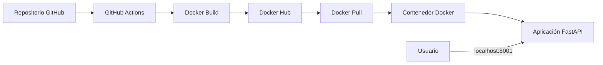

# 🐳 Proyecto Final DevOps

**Aplicación FastAPI contenerizada con Docker, versionada con GitFlow y publicada en Docker Hub mediante GitHub Actions.**


---

## 📖 Descripción

Este repositorio contiene el desarrollo del **Trabajo Final DevOps**.  
El proyecto implementa una aplicación web con **FastAPI**, construye una imagen **Docker**, publica la imagen en **Docker Hub** y automatiza el proceso mediante **GitHub Actions**.

La aplicación muestra información del grupo, integrantes, curso, ambiente de ejecución, estado del servicio, datos del contenedor y endpoints disponibles.

---

## 👥 Datos del grupo

| Campo | Información |
|---|---|
| Grupo | Grupo 1 |
| Integrantes | César Jácome, Marcela Baldeón |
| Curso | Curso de Profesionalización en DevOps |
| Puerto oficial | 8001 |
| URL local | http://localhost:8001 |
| Imagen Docker | `cefer181/devops-final-project:v1` |
| Tag Git final | `v1.0.1` |
| Tag Docker | `v1` |

---

## 🎯 Objetivos

- 🐳 Contenerizar una aplicación web con Docker.
- ⚡ Implementar una aplicación con FastAPI.
- 📦 Construir y publicar una imagen Docker.
- ❤️ Configurar un `HEALTHCHECK` para validar el estado del contenedor.
- 🔀 Aplicar GitFlow para organizar el desarrollo.
- 🏷️ Crear releases y tags de versión.
- ⚙️ Automatizar la publicación con GitHub Actions.
- 📄 Documentar el proceso técnico y las evidencias.

---

## 🏗️ Arquitectura general



---

## 📂 Organización del repositorio

```text
proyecto-final-devops/
│
├── 📁 app/
│   ├── 📄 main.py
│   └── 📁 templates/
│       └── 📄 index.html
│
├── 📁 docs/
│   ├── 📁 capturas/
│   └── 📁 evidencias/
│
├── 📄 .dockerignore
├── 📄 .gitignore
├── 📄 Dockerfile
├── 📄 INFORME.md
├── 📄 README.md
├── 📄 VERSION
└── 📄 requirements.txt
```

---

## 📌 Archivos principales

| Archivo / Carpeta | Descripción |
|---|---|
| `app/main.py` | Aplicación principal desarrollada con FastAPI. |
| `app/templates/index.html` | Plantilla visual de la página principal. |
| `Dockerfile` | Archivo para construir la imagen Docker. |
| `.dockerignore` | Excluye archivos innecesarios del contexto Docker. |
| `requirements.txt` | Dependencias necesarias del proyecto. |
| `docs/capturas/` | Capturas de pantalla utilizadas como evidencia. |
| `docs/evidencias/` | Salidas de comandos y pruebas realizadas. |
| `INFORME.md` | Informe técnico completo del trabajo final. |

---

## 🛠️ Tecnologías utilizadas

| Tecnología | Uso |
|---|---|
| 🐍 Python 3.12 | Lenguaje base de la aplicación. |
| ⚡ FastAPI | Framework web/API. |
| 🧩 Jinja2 | Renderizado de plantilla HTML. |
| 🐳 Docker | Contenerización de la aplicación. |
| 📦 Docker Hub | Publicación de la imagen. |
| 🔀 GitFlow | Gestión de ramas y versiones. |
| ⚙️ GitHub Actions | Automatización CI/CD. |
| 🐧 Linux | Entorno de ejecución y pruebas. |

---

## 🚀 Ejecución oficial Grupo 1

```bash
docker run -d \
  --name devops-final-project \
  -p 8001:8000 \
  -e GROUP_NAME="Grupo 1" \
  -e GROUP_MEMBERS="César Jácome, Marcela Baldeón" \
  -e COURSE_NAME="Curso de Profesionalización en DevOps" \
  cefer181/devops-final-project:v1
```

Abrir en el navegador:

```text
http://localhost:8001
```

> El puerto `8001` es el puerto oficial asignado al Grupo 1.  
> El puerto interno del contenedor es `8000`.

---

## 🔍 Verificación

Validar contenedor:

```bash
docker ps -a
```

Validar estado del healthcheck:

```bash
docker inspect --format='{{.State.Health.Status}}' devops-final-project
```

Resultado esperado:

```text
healthy
```

---

## 🔗 Endpoints disponibles

| Endpoint | Descripción |
|---|---|
| `/` | Página principal de la aplicación. |
| `/health` | Verificación del estado del servicio. |
| `/info` | Información de la aplicación, grupo y contenedor. |
| `/metrics` | Métricas básicas de ejecución. |

Pruebas:

```bash
curl http://localhost:8001/health
curl http://localhost:8001/info
curl http://localhost:8001/metrics
```

---

## 📦 Imagen Docker publicada

```text
cefer181/devops-final-project:v1
```

Descarga:

```bash
docker pull cefer181/devops-final-project:v1
```

---

## 🔗 Repositorios de entrega

| Integrante | GitHub | Docker Hub |
|---|---|---|
| César Jácome | https://github.com/cefer181/proyecto-final-devops | https://hub.docker.com/r/cefer181/devops-final-project |
| Marcela Baldeón | https://github.com/MarchelitaBG/proyecto-final-devops-MB | https://hub.docker.com/r/marchelita/devops-final-project/tags |

---

## 🧪 Validación alternativa del instructor

El instructor puede validar la misma imagen utilizando otro puerto externo, por ejemplo `9000`:

```bash
docker run -d \
  --name validacion-instructor \
  -p 9000:8000 \
  -e GROUP_NAME="Grupo 1" \
  -e GROUP_MEMBERS="César Jácome, Marcela Baldeón" \
  -e COURSE_NAME="Curso de Profesionalización en DevOps" \
  cefer181/devops-final-project:v1
```

URL alternativa:

```text
http://localhost:9000
```

> Esta validación usa `9000` solo como referencia.  
> Para la entrega oficial del Grupo 1 se utiliza `8001`.

---

## 🌟 Buenas prácticas aplicadas

- Uso de imagen base liviana `python:3.12-slim`.
- Separación de dependencias con `requirements.txt`.
- Uso de `.dockerignore`.
- Configuración mediante variables de entorno.
- Implementación de `HEALTHCHECK`.
- Versionamiento con GitFlow.
- Publicación automática mediante GitHub Actions.
- Documentación técnica en Markdown.

---

## ✅ Resultado esperado

La aplicación debe ejecutarse en:

```text
http://localhost:8001
```

El contenedor debe mostrarse en estado:

```text
healthy
```

---

## 🎓 Material académico

Proyecto desarrollado como parte del **Curso de Profesionalización en DevOps**.

**🐳 Docker • ⚡ FastAPI • 🚀 DevOps • 🔀 GitFlow • ⚙️ GitHub Actions**
